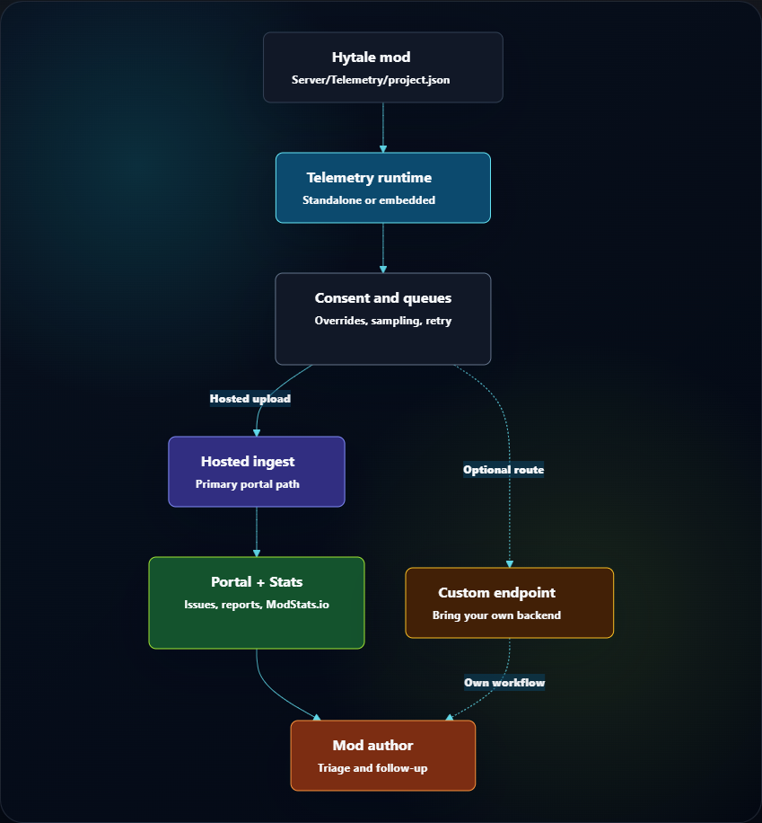
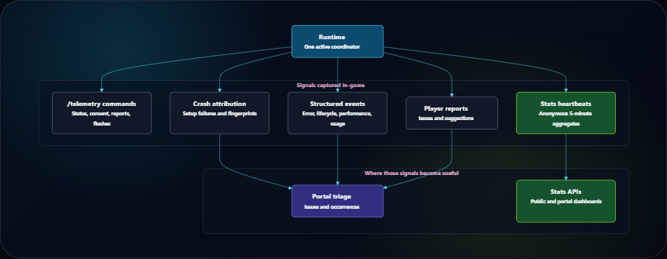

# Beacon & ModStats.io

[](https://www.modstats.io/stats/beacon)

Beacon is the all-in-one telemetry solution for Hytale mods: a runtime that
runs in-game, a [web portal](https://beacon.modstats.io/portal) for mod authors, a [public mod stats](https://www.modstats.io/stats) list, and a [server browser](https://www.modstats.io/servers) that helps players find verified servers by mod.

It started as crash reporting, but it now covers the broader support loop around
a mod: attributed crashes, structured errors, automatic diagnostic bundles,
lifecycle and performance events, anonymous usage stats, manual player issue
reports, project access, ingest keys, and portal-based triage.

[Open Beacon Portal](https://beacon.modstats.io/portal) | [Runtime Downloads](https://beacon.modstats.io/downloads) | [View Public Stats](https://www.modstats.io/stats/beacon) | [Browse Servers](https://www.modstats.io/servers) | [Join Discord](https://discord.gg/E8n8RgTTdq)

## Migrate From Alec's Telemetry 1.x

Beacon 2.0 is a breaking rename. There is no namespace compatibility layer.
Update every integration coordinate, import, path, command, and endpoint before
you build the new release.

### Build Coordinates

Replace the old Maven repository with:

```text
https://beacon.modstats.io/maven/releases
```

Replace these coordinates:

| Alec's Telemetry 1.x | Beacon 2.x |
| --- | --- |
| `com.alechilles:alecstelemetry-parent` | `com.alechilles:beacon-parent` |
| `com.alechilles:alecstelemetry-runtime` | `com.alechilles:beacon-runtime` |
| `com.alechilles:alecstelemetry` | `com.alechilles:beacon` |

For example, an embedded Gradle dependency becomes:

```kotlin
implementation("com.alechilles:beacon-runtime:2.0.0")
```

Old Maven coordinates remain only as a read-only historical archive. They do
not provide Beacon 2.x.

### Manifest And Java Names

If your manifest requires the standalone runtime, replace:

```json
"Alechilles:Alec's Telemetry!": ">=0.1.0"
```

with:

```json
"Alechilles:Beacon": ">=2.0.0"
```

Change Java imports from `com.alechilles.alecstelemetry...` to
`com.alechilles.beacon...`. Change the standalone entry point from
`com.alechilles.alecstelemetry.AlecsTelemetry` to
`com.alechilles.beacon.Beacon` when your build declares it explicitly.

### Descriptors And Embedded Bootstrap

Change a conventional descriptor path from:

```text
Server/Telemetry/project.json
```

to:

```text
Server/Beacon/project.json
```

Change passive or contribution descriptor resources from
`META-INF/alecs-telemetry/projects/` to `META-INF/beacon/projects/`.
Update embedded bootstrap imports to the `com.alechilles.beacon.embedded`
package and use the Beacon runtime artifact. Keep publishing the runtime's
`Common/**` asset pack, including `Common/UI/Custom/TelemetryConsentPage.ui`.
New integrations should use the Beacon paths. Beacon 2.x still accepts
`Server/Telemetry/project.json`, the older `telemetry/project.json`, and
`META-INF/alecs-telemetry/projects/` as deprecated fallbacks. If a mod contains
both canonical and legacy descriptors, Beacon loads only the canonical path.

### Command And Hosted Origin

Replace `/telemetry` with `/beacon` and replace the permission prefix
`telemetry.command.telemetry` with `beacon.command.beacon`. There is no old
command alias.

Change the hosted origin from `https://telemetry.alecsmods.com` to
`https://beacon.modstats.io`. The ingest route names remain
`/ingest/crash`, `/ingest/event`, and `/ingest/report`.

### Local Data

Beacon stores runtime state under:

```text
mods/Alechilles_Beacon/
```

On the first Beacon startup, the runtime makes one copy-only migration from
known Alec-created roots, including `mods/Alechilles_Alec's Telemetry!/`,
`mods/Alechilles_Alec's Telemetry/`, save-level `Telemetry/` or `telemetry/`
roots, and embedded owner `Telemetry/Settings/projects/` roots. It copies each
known state file only when the Beacon destination is absent. It keeps every old
source. When both files exist, the Beacon file is used and the old file remains.
Beacon does not read legacy owner override paths after this migration attempt.

## The Combined Solution

Beacon works best as a pair:

- the runtime discovers telemetry-enabled mods, applies consent and server-owner
  overrides, queues reports locally, and uploads sanitized envelopes
- the web portal owns projects, keys, memberships, issues, manual reports,
  stats, server profiles, public visibility, and operator workflows



Most mods should use the web portal. If you need to send data to your own
backend, the same runtime can target custom endpoints instead.

## What It Handles



- Crash and setup failure capture: attributed stack traces, fingerprints,
  breadcrumbs, local queueing, and hosted issue grouping.
- Structured runtime events: explicit errors, lifecycle timings, performance
  measurements, feature usage events, and descriptor-validated Event Context.
- Diagnostic bundles: bounded automatic technical evidence with opaque
  attachments and project-scoped issue grouping. Diagnostics has its own `Diag`
  consent category and is independent from Error events.
- Public usage stats: aggregate active servers, active players, environment
  breakdowns, versions, loaded mods, and public embed cards through ModStats.io.
- Server browser: server owners can publish verified public server listings,
  control public player counts, public mod lists, and join information, and show
  servers running a public mod.
- Manual player reports: in-game issue and suggestion forms with local receipts,
  optional log attachments, server-owner review controls, and portal follow-up.
- Runtime coordination: standalone and embedded copies participate in version
  election so one active runtime can serve all enabled projects.
- Consent and overrides: descriptor defaults seed the first-run consent UI, while
  server owners keep final control through runtime settings and per-project
  overrides.

## Who It Is For
Beacon is meant to benefit _everyone_ in the Hytale modding ecosystem.

For mod authors, Beacon turns real-world support signals into a small,
repeatable integration: ship a descriptor, add a portal project key, and let the
runtime and portal handle the plumbing.

For server owners, it keeps telemetry visible and controllable. Crash capture,
usage events, performance telemetry, stats, breadcrumbs, reports, and automatic
diagnostics are separate categories with runtime-level controls. Diagnostics is
off by default unless a descriptor explicitly sets `defaultEnabled: true`.
Server owners can also list a public server after installing Beacon,
without creating a mod project.

For players and communities, it shortens the path from "something broke" to a
real fix, while public stats can show whether a mod is actively used without
exposing raw server or player data.

## Quick Setup For Mod Authors

### Conventional host descriptor

Most conventional web portal integrations start with a descriptor at:

```text
Server/Beacon/project.json
```

If your `manifest.json` already has the right `Group`, `Name`, and `Main`,
Beacon can infer the project id, display name, plugin identifier, and
package prefix.

This minimal descriptor connects your packaged mod or asset pack to a portal
project. It does not enable any telemetry category by itself.

```json
{
  "hosted": {
    "projectKey": "replace_with_your_public_project_key"
  }
}
```

Portal `projectKey` values are publishable ingest keys. They are meant to ship
inside the descriptor; admin capabilities stay in the portal, not in the key.

Add only the telemetry categories your project actually supports. For example,
stats-only projects add:

```json
{
  "hosted": {
    "projectKey": "replace_with_your_public_project_key"
  },
  "telemetry": {
    "stats": {
      "supported": true
    }
  }
}
```

If you want your mod logo in the consent UI, package the texture under
`Common/UI/Custom/...` and set `ui.iconTexturePath` to that custom UI texture
path. Root mod icons such as `icon-256.png` are not used automatically.

### Descriptor-only embedded library

An embeddable or shaded library can opt into aggregate project stats without
depending on Beacon or running any Telemetry Java code. Put a direct
JSON resource in the final host JAR (or host mod folder) at:

```text
META-INF/beacon/projects/<stable-project-id>.json
```

Presence of a valid resource is the installation signal. A standalone or
embedded Beacon runtime still has to be installed somewhere in the
process to discover and process it; without a runtime, the descriptor is inert
and the host continues normally. Passive discovery exposes only the aggregate
Stats `heartbeat` capability, even when the descriptor contains additional
category definitions for a future active integration.

The passive descriptor must include the library's logical identity and version,
not the physical host mod's manifest version:

```json
{
  "schemaVersion": 1,
  "projectId": "creditor",
  "projectVersion": "1.4.0",
  "displayName": "Creditor",
  "ownerPluginIdentifiers": ["Author:Creditor"],
  "hosted": {
    "projectKey": "your_public_project_key"
  },
  "telemetry": {
    "stats": {
      "supported": true,
      "allowedEvents": ["heartbeat"]
    }
  }
}
```

This example uses the Beacon hosted destination. A passive descriptor may instead
set `defaults.destinationMode` to `custom` and provide `customEndpoint.url` (and
the optional event endpoint/headers). In that mode the standard Stats-only
heartbeat is delivered to the author-selected endpoint rather than Beacon's
hosted ingest; that endpoint's operator controls the received data, security,
and retention.

Build-stamp `projectVersion` with the logical library release. If the same
descriptor is present in several host mods, Telemetry elects one logical
project (the highest logical semantic version, then source kind and
deterministic host/path/hash tie-breakers), so consent and Stats contain one row
and one heartbeat project rather than one per host. Invalid descriptors are
skipped without blocking the host mod.

If the library later needs crash, error, diagnostics, usage, performance,
lifecycle, breadcrumbs, or report telemetry, add an explicit
`EmbeddedTelemetryBootstrap.contribute(...)` registration using the same
descriptor resource, `projectId`, logical version, and declared owner. That
active registration upgrades the existing passive row; it does not create a
second project. If a persisted supported-category snapshot exists for the
previously reviewed logical project, newly exposed categories remain disabled
until an operator reviews them in `/beacon consent`; eligible operators are
notified. For a legacy reviewed record without a supported-category snapshot,
newly supported Diagnostics also remains disabled until the operator saves new
consent choices; older category approvals remain honored.

## Quick Setup For Server Owners

You do not need to create a mod project to list your server in the ModStats
server browser.

1. Install Beacon on the Hytale server.
2. Start the server at least once.
3. Open the portal and create a server profile.
4. Run the verification command shown by the portal:

```text
/beacon server verify <claim-token>
```

The portal uses that claim heartbeat to bind the public server profile to the
server. Server owners control whether the listing, player counts, mod list, and
join information are public.

## Runtime Options

### Standalone Dependency

Use the standalone Beacon mod when you want the normal dependency
model. The runtime discovers conventional host descriptors and valid passive
namespaced descriptors from installed mods, then coordinates uploads for those
projects.

List Beacon as a dependency on distribution platforms such as
CurseForge, Modtale, and Modifold so server owners know to install it alongside
your mod. Passive descriptor-only integrations do not require a
`manifest.json` dependency and report only aggregate Stats. Conventional
descriptors can still expose their declared categories when a runtime is
present. Omit the dependency entirely when your mod should still boot without
telemetry installed. Add `Alechilles:Beacon` to `Dependencies` only
when you intentionally want Hytale to require the runtime before loading your
mod. Java runtime API integrations should locate the runtime defensively as
shown in the wiki.

### Embedded Runtime

Use embedded mode when your mod needs to bundle the telemetry bootstrap directly.
Embedded copies still participate in coordinator election, and the latest
compatible runtime can serve all installed enabled projects, including passive
descriptors carried by other shaded libraries. A library that ships only a
descriptor does not need to bundle or initialize this runtime.

The embeddable runtime artifact is published through the Beacon downloads
page and Maven-format repository:

```text
https://beacon.modstats.io/downloads
https://beacon.modstats.io/maven/releases
```

```xml
<repository>
  <id>beacon</id>
  <url>https://beacon.modstats.io/maven/releases</url>
</repository>

<dependency>
  <groupId>com.alechilles</groupId>
  <artifactId>beacon-runtime</artifactId>
  <version>2.0.0</version>
</dependency>
```

Gradle Kotlin DSL:

```kotlin
repositories {
    maven {
        url = uri("https://beacon.modstats.io/maven/releases")
    }
}

dependencies {
    implementation("com.alechilles:beacon-runtime:2.0.0")
}
```

An embedded host must also publish the runtime's client UI as an Hytale asset
pack. Set `IncludesAssetPack` to `true`, and merge the runtime artifact's
`Common/**` resources into the host asset-pack source during packaging. Shading
the Java classes is not sufficient. Confirm that the final mod contains
`Common/UI/Custom/TelemetryConsentPage.ui`; otherwise `/beacon consent`
disconnects the client because Hytale cannot find the UI document. See
[Embedded Mode](docs/embedded-mode.md) for a Gradle example.

### Custom Endpoint

Use a custom endpoint when you want the runtime but not the Beacon web portal.

```json
{
  "defaults": {
    "destinationMode": "custom"
  },
  "customEndpoint": {
    "url": "https://example.com/api/telemetry/crash",
    "eventUrl": "https://example.com/api/telemetry/event"
  }
}
```

Server owners can also override packaged destination settings at runtime under:

```text
mods/Alechilles_Beacon/Settings/projects/<project-id>.json
```

## Web Portal

The web portal is the management surface for Beacon projects
and verified server listings.

- Sign in with Discord or GitHub.
- Manage project memberships and publishable project keys.
- Review crash groups, issue-producing events, and individual occurrences.
- Inspect manual player reports and link or promote them into issue workflows.
- View public and portal-only stats dashboards.
- Configure public stats visibility and ModStats.io slugs.
- Create verified server profiles and manage public server listing settings.
- Configure Discord routing and GitHub issue sync when your team wants them.

Portal URL:

```text
https://beacon.modstats.io/portal
```

Public stats:

```text
https://www.modstats.io/stats/beacon
```

Server browser:

```text
https://www.modstats.io/servers
```

## Runtime API

Mods can stay descriptor-only, but richer integrations can call the runtime API
for explicit events, diagnostic bundles, and custom player-report entry points.
A shaded library that
wants categories beyond passive Stats must register explicitly with
`EmbeddedTelemetryBootstrap.contribute(...)`; use the same logical identity,
version, and descriptor as the passive resource so the coordinator upgrades the
existing project instead of creating a duplicate.

```java
TelemetryRuntimeApi api = TelemetryRuntimeLocator.tryGet();
if (api == null || !api.isEnabled()) {
    return;
}

TelemetryProjectHandle project = api.findProject("example-consumer-mod");
if (project == null || !project.isEnabled()) {
    return;
}

project.recordPerformanceWithContext(
        "reload_config_duration",
        durationMs,
        null,
        TelemetryEventContext.performance()
                .subsystem("config")
                .phase("reload")
                .operation("apply")
                .runtimeSide("server")
                .detail("configFileCount", configFileCount)
                .build()
);
```

The runtime ignores events that are disabled by consent, descriptor defaults,
runtime overrides, sampling, or descriptor allowlists.

## Useful Commands

```text
/beacon status
/beacon projects
/beacon project <project-id>
/beacon consent
/beacon report [project-id] [issue|suggestion]
/beacon reports pending
/beacon reports submitted
/beacon server verify <claim-token>
/beacon flush [project-id]
/beacon test <project-id> [detail]
```

The root command permission is `beacon.command.beacon`; subcommands use the
same stable `beacon.command.beacon.*` prefix.

## Privacy Model

- Server owners control telemetry categories through consent and runtime
  overrides. Automatic diagnostics uses the independent `Diag` category and is
  off by default unless the descriptor explicitly enables it.
- Public stats expose aggregate counts and breakdowns, not raw server ids,
  session ids, IP addresses, player names, player UUIDs, chat, coordinates,
  secrets, or full config files.
- Custom Event Context fields must be descriptor-declared and type-checked before
  upload.
- Manual reports can require local operator review before upload, and optional
  attachments are controlled by runtime settings.

For the full runtime, web portal, and ModStats.io policy, see
[Beacon Privacy Policy](https://github.com/Alechilles/Beacon/blob/main/docs/privacy-policy.md).

## Docs and Examples

- [Project descriptor reference](https://github.com/Alechilles/Beacon/blob/main/docs/project-descriptor.md)
- [Embedded contributions and passive descriptors](https://github.com/Alechilles/Beacon/blob/main/docs/embedded-contributions.md)
- [Runtime API guide](https://github.com/Alechilles/Beacon/blob/main/docs/runtime-api.md)
- [Runtime downloads](https://beacon.modstats.io/downloads)
- [Command reference](https://github.com/Alechilles/Beacon/blob/main/docs/command-reference.md)
- [Runtime overrides](https://github.com/Alechilles/Beacon/blob/main/docs/runtime-overrides.md)
- [Privacy policy](https://github.com/Alechilles/Beacon/blob/main/docs/privacy-policy.md)
- [Manual player reports](https://github.com/Alechilles/Beacon/blob/main/docs/manual-player-reports.md)
- [Diagnostic bundles](https://github.com/Alechilles/Beacon/blob/main/docs/diagnostic-bundles.md)
- [Usage stats guide](https://github.com/Alechilles/Beacon/blob/main/docs/usage-stats.md)
- [Public wiki](https://wiki.hytalemodding.dev/mod/beacon/home)
- [Beacon 2.0 migration guide](https://wiki.hytalemodding.dev/mod/beacon/migrate-to-beacon-2-0)
- [Project key operations](https://wiki.hytalemodding.dev/mod/beacon/project-key-operations)
- [Ingest contract](https://wiki.hytalemodding.dev/mod/beacon/ingest-contract)
- [Server browser guide](https://wiki.hytalemodding.dev/mod/beacon/server-browser)
- [Example consumer mod](https://github.com/Alechilles/Beacon/tree/main/examples/ExampleConsumerMod)
- [Embedded consumer mod](https://github.com/Alechilles/Beacon/tree/main/examples/EmbeddedConsumerMod)

## License / Support

This project is source-available under the Beacon Runtime License.

- [License](https://github.com/Alechilles/Beacon/blob/main/LICENSE)
- [License FAQ](https://github.com/Alechilles/Beacon/blob/main/LICENSE-FAQ.md)
- [Commercial License](https://github.com/Alechilles/Beacon/blob/main/COMMERCIAL-LICENSE.md)
- [Discord support and issue reporting](https://discord.gg/E8n8RgTTdq)
