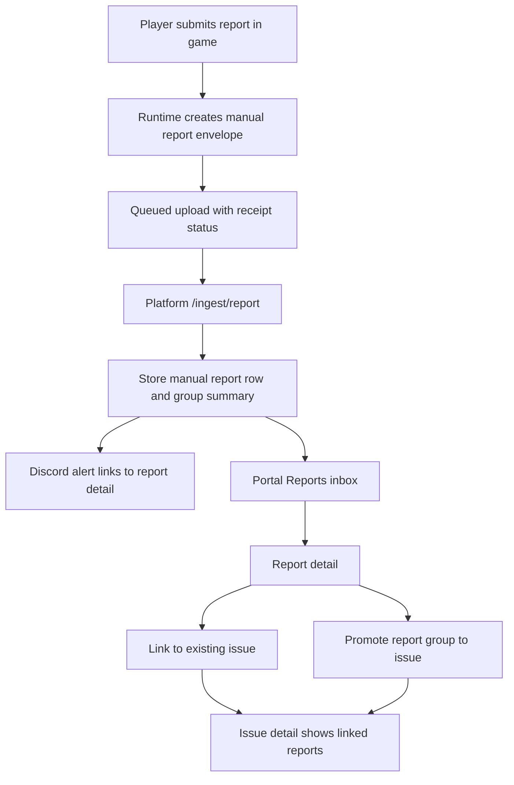

# Dedicated Manual Reports Flow Implementation Plan

> **For agentic workers:** REQUIRED SUB-SKILL: Use superpowers:executing-plans to implement this plan task-by-task. Use superpowers:test-driven-development for each code milestone. Steps use checkbox (`- [ ]`) syntax for tracking.

**Goal:** Split player-submitted manual reports from normal portal issues, preserve every submitted field on a dedicated report detail page, allow reports to be promoted or linked to issues later, and fix runtime report context so "loaded mods" means mods actually active on the server at submission time.

**Architecture:** Manual reports become an inbox-first workflow. The game runtime submits a complete immutable report envelope. The platform stores the raw report independently from issue records, sends Discord notifications to the report detail page, and exposes explicit actions to link reports to existing issues or promote report groups into issues. Issues remain triaged work items; reports remain source evidence.

**Tech Stack:** Java 25, Maven, JUnit 5, Gson, Hytale Custom UI, Node 20, TypeScript, Zod, Postgres, Vitest, React, React Router, AG Grid, existing AlecsTelemetry and AlecsTelemetryPlatform repositories.

---

## Product Decisions

- Manual reports are not issues by default.
- The report inbox is the canonical first stop for player-submitted issues and suggestions.
- A report may have no linked issue, one linked issue, or contribute evidence to an existing issue.
- A portal issue may have zero or many linked manual reports.
- Discord manual report alerts link to report details, not the issue detail page.
- The Issues page should show crash groups, issue-worthy telemetry events, and manually promoted report issues only.
- The Reports page should show all player-submitted manual reports, including untriaged reports.
- The report detail page should display the submitted title, description, contact flag/value, form values, attachments, runtime context, environment, diagnostics, and raw JSON.
- Report title fallback should be human-readable. Selector literals such as `#TelemetryReportTitle.Value` must never persist as report titles.
- "Installed mod list" should be renamed to "Loaded mods" or "Running mods" in UI and payload labels.
- Loaded mods in a report must come from the active server/runtime snapshot, not from scanning every installed mod folder.

## Target Flow



## Repositories

- Mod/runtime repo: `C:\Users\22ale\AppData\Roaming\Hytale\Modding\AlecsTelemetry`
- Platform/portal repo: `C:\Users\22ale\AppData\Roaming\Hytale\Modding\AlecsTelemetryPlatform`

---

## Milestone 1: Stop Bad Report Values at the Source

**Intent:** Fix the current `#TelemetryReportTitle.Value`/selector-literal leak and make submitted form values visible in the payload before changing portal workflow.

- [x] Add focused tests for selector literal rejection and title fallback.

  Create or update:

  - `C:\Users\22ale\AppData\Roaming\Hytale\Modding\AlecsTelemetry\runtime\src\test\java\com\alechilles\alecstelemetry\report\ManualReportEnvelopeTest.java`
  - `C:\Users\22ale\AppData\Roaming\Hytale\Modding\AlecsTelemetry\standalone\src\test\java\com\alechilles\alecstelemetry\reports\TelemetryReportViewModelTest.java`

  Expected assertions:

  ```java
  assertThat(sanitized.title()).isEqualTo("Untitled issue report");
  assertThat(sanitized.description()).isEqualTo("");
  assertThat(sanitized.formValues()).doesNotContainValue("#TelemetryReportFieldValue.Value");
  ```

- [x] Add a small report input sanitizer instead of spreading selector checks through UI code.

  Add:

  - `C:\Users\22ale\AppData\Roaming\Hytale\Modding\AlecsTelemetry\runtime\src\main\java\com\alechilles\alecstelemetry\report\ManualReportInputSanitizer.java`

  Rules:

  - Trim string values.
  - Treat empty strings as empty.
  - Treat values matching `^#TelemetryReport[A-Za-z0-9_.-]+$` as empty.
  - Treat values containing ` #TelemetryReport` selector fragments as empty.
  - Apply the sanitizer before writing `ManualReportEnvelope`.
  - Use `Untitled issue report` and `Untitled suggestion report` only when the title is empty after sanitizing.

- [x] Fix the Hytale UI event binding so real text field values are posted.

  Modify:

  - `C:\Users\22ale\AppData\Roaming\Hytale\Modding\AlecsTelemetry\standalone\src\main\java\com\alechilles\alecstelemetry\reports\TelemetryReportPage.java`

  Current risky binding:

  ```java
  EventData.of(KEY_ACTION, ACTION_UPDATE_TITLE)
      .append(KEY_TITLE, "#TelemetryReportTitle.Value");
  ```

  Required implementation behavior:

  - Use the Hytale Custom UI binding pattern that sends the current bindable text value instead of sending the selector string literally.
  - Keep the sanitizer as a defensive guard so a future UI binding regression cannot pollute stored reports.
  - Verify title, description, contact, and dynamic schema fields with in-game manual submission.

- [x] Add or update a hosted ingest test that rejects selector literals in persisted reports.

  Modify:

  - `C:\Users\22ale\AppData\Roaming\Hytale\Modding\AlecsTelemetry\hosted\tests\manual-report-ingest-service.test.ts`
  - `C:\Users\22ale\AppData\Roaming\Hytale\Modding\AlecsTelemetry\hosted\src\contract\manual-report-envelope.ts`

  Expected persisted values:

  ```ts
  expect(record.title).toBe("Untitled issue report");
  expect(record.description).toBe("");
  expect(record.formValues.area).toBeUndefined();
  ```

---

## Milestone 2: Capture Active Loaded Mods, Not Installed Mods

**Intent:** The player report context should describe the running server. Project discovery can still scan installed projects for the selector UI, but report context must not reuse that scan as the loaded-mod list.

- [x] Introduce a runtime loaded-mod snapshot boundary.

  Add:

  - `C:\Users\22ale\AppData\Roaming\Hytale\Modding\AlecsTelemetry\standalone\src\main\java\com\alechilles\alecstelemetry\runtime\TelemetryLoadedModSnapshotProvider.java`

  Shape:

  ```java
  public interface TelemetryLoadedModSnapshotProvider {
      List<CrashReportEnvelope.LoadedModMetadata> snapshotLoadedMods();
  }
  ```

- [x] Wire the provider into report submission context.

  Modify:

  - `C:\Users\22ale\AppData\Roaming\Hytale\Modding\AlecsTelemetry\standalone\src\main\java\com\alechilles\alecstelemetry\runtime\TelemetryRuntimeService.java`
  - `C:\Users\22ale\AppData\Roaming\Hytale\Modding\AlecsTelemetry\standalone\src\main\java\com\alechilles\alecstelemetry\reports\TelemetryReportPage.java`

  Required behavior:

  - `TelemetryReportPage.submit(...)` must not pass `PlayerReportRuntimeContext.UNKNOWN`.
  - The runtime service should build a `PlayerReportRuntimeContext` containing:
    - singleplayer/multiplayer
    - online player count
    - world name when available
    - active loaded mods from `TelemetryLoadedModSnapshotProvider`

- [x] Keep project discovery separate from runtime loaded mods.

  Modify only if labels or method names are confusing:

  - `C:\Users\22ale\AppData\Roaming\Hytale\Modding\AlecsTelemetry\standalone\src\main\java\com\alechilles\alecstelemetry\project\TelemetryProjectDiscovery.java`

  Constraint:

  - This class can continue scanning installed mod folders for report-capable telemetry projects.
  - Do not use its discovered project list as the report's loaded-mod context.

- [x] Update player-facing labels.

  Modify:

  - `C:\Users\22ale\AppData\Roaming\Hytale\Modding\AlecsTelemetry\standalone\src\main\java\com\alechilles\alecstelemetry\reports\TelemetryReportPage.java`
  - Report docs in `C:\Users\22ale\AppData\Roaming\Hytale\Modding\AlecsTelemetry\docs\manual-player-reports.md`

  Rename:

  - `Installed mod list` to `Loaded mods`
  - Any payload/help copy that implies inactive installed mods are included

- [x] Add regression tests for context precedence.

  Modify:

  - `C:\Users\22ale\AppData\Roaming\Hytale\Modding\AlecsTelemetry\standalone\src\test\java\com\alechilles\alecstelemetry\runtime\TelemetryRuntimeServiceTest.java`
  - `C:\Users\22ale\AppData\Roaming\Hytale\Modding\AlecsTelemetry\runtime\src\test\java\com\alechilles\alecstelemetry\report\ManualReportEnvelopeTest.java`

  Assertions:

  ```java
  assertThat(envelope.runtime().loadedMods())
      .extracting(CrashReportEnvelope.LoadedModMetadata::pluginIdentifier)
      .containsExactly("alecs-tamework");
  ```

  Also assert that an installed-but-not-loaded fixture mod is absent.

---

## Milestone 3: Platform Storage Separates Reports from Issues

**Intent:** Persist manual reports as first-class records with nullable issue links. Stop automatically mixing every manual report into the normal issue list.

- [x] Add or confirm nullable issue link migration.

  Modify or add a migration under:

  - `C:\Users\22ale\AppData\Roaming\Hytale\Modding\AlecsTelemetryPlatform\src\db\migrations`

  Required schema behavior:

  ```sql
  ALTER TABLE telemetry_manual_reports
    ALTER COLUMN issue_id DROP NOT NULL;

  CREATE INDEX IF NOT EXISTS telemetry_manual_reports_project_received_idx
    ON telemetry_manual_reports(project_id, received_at DESC);

  CREATE INDEX IF NOT EXISTS telemetry_manual_reports_project_issue_idx
    ON telemetry_manual_reports(project_id, issue_id)
    WHERE issue_id IS NOT NULL;
  ```

- [x] Make manual report persistence accept no issue.

  Modify:

  - `C:\Users\22ale\AppData\Roaming\Hytale\Modding\AlecsTelemetryPlatform\src\db\repositories\telemetry-manual-report-repo.ts`
  - `C:\Users\22ale\AppData\Roaming\Hytale\Modding\AlecsTelemetryPlatform\tests\telemetry-report-repo.test.ts`

  Change:

  ```ts
  issueId: string;
  ```

  To:

  ```ts
  issueId?: string | null;
  ```

  Required behavior:

  - New reports insert `issue_id = null` unless the caller explicitly links one.
  - Existing duplicate reports keep a non-null issue link if already linked.
  - `listReports(projectId, { issueId })` still returns linked reports.

- [x] Stop automatic issue production for manual reports.

  Modify:

  - `C:\Users\22ale\AppData\Roaming\Hytale\Modding\AlecsTelemetryPlatform\src\telemetry\accepted-occurrence.ts`
  - `C:\Users\22ale\AppData\Roaming\Hytale\Modding\AlecsTelemetryPlatform\tests\telemetry-accepted-occurrence.test.ts`
  - Any ingest service that calls `buildManualReportAcceptedOccurrence(...)`

  Required value:

  ```ts
  issueProducing: false
  ```

  If manual report occurrences are still useful for global occurrence history, keep the occurrence row but make it non-issue-producing.

- [x] Remove unlinked manual reports from the normal Issues list.

  Modify:

  - `C:\Users\22ale\AppData\Roaming\Hytale\Modding\AlecsTelemetryPlatform\src\db\repositories\telemetry-issue-repo.ts`
  - `C:\Users\22ale\AppData\Roaming\Hytale\Modding\AlecsTelemetryPlatform\tests\telemetry-issue-repo.test.ts`
  - `C:\Users\22ale\AppData\Roaming\Hytale\Modding\AlecsTelemetryPlatform\tests\telemetry-issue-listing.test.ts`

  Required behavior:

  - `listIssues(projectId)` does not include manual report groups with no linked/promoted issue.
  - `getIssue(projectId, issueId)` still works for a promoted manual-report issue.
  - Linked manual reports can be displayed as evidence on a promoted/manual issue.

---

## Milestone 4: Add Manual Reports API

**Intent:** Give the portal an API surface that treats manual reports as reports, not as synthetic issue occurrences.

- [ ] Add API response contracts.

  Add:

  - `C:\Users\22ale\AppData\Roaming\Hytale\Modding\AlecsTelemetryPlatform\src\portal\manual-report-view-model.ts`

  Include:

  ```ts
  export interface PortalManualReportListItem {
    reportId: string;
    reportKind: "issue" | "suggestion";
    status: "received" | "triaged" | "resolved" | "rejected";
    title: string;
    descriptionPreview: string;
    contactProvided: boolean;
    issueId: string | null;
    groupKey: string;
    submittedAt: string | null;
    receivedAt: string;
    pluginVersion: string | null;
    area: string | null;
    severity: string | null;
    source: string | null;
  }
  ```

  Detail model must also include:

  - full `description`
  - `contactValue`
  - `formValues`
  - `attachmentManifests`
  - attachment content metadata and content where safe
  - `context`
  - `environment`
  - `runtime`
  - `rawJson`

- [ ] Add portal routes.

  Modify or add:

  - `C:\Users\22ale\AppData\Roaming\Hytale\Modding\AlecsTelemetryPlatform\src\portal\portal-server.ts`
  - `C:\Users\22ale\AppData\Roaming\Hytale\Modding\AlecsTelemetryPlatform\src\portal\manual-report-routes.ts`
  - `C:\Users\22ale\AppData\Roaming\Hytale\Modding\AlecsTelemetryPlatform\tests\portal-server-routes.test.ts`

  Routes:

  ```text
  GET  /api/projects/:projectId/manual-reports
  GET  /api/projects/:projectId/manual-reports/:reportId
  POST /api/projects/:projectId/manual-reports/:reportId/link-issue
  POST /api/projects/:projectId/manual-reports/:reportId/promote
  POST /api/projects/:projectId/manual-reports/:reportId/status
  ```

  Request bodies:

  ```ts
  const linkIssueBody = z.object({
    issueId: z.string().min(1).max(300)
  });

  const promoteBody = z.object({
    title: z.string().min(1).max(240).optional(),
    includeGroup: z.boolean().default(true)
  });

  const statusBody = z.object({
    status: z.enum(["received", "triaged", "resolved", "rejected"])
  });
  ```

- [ ] Add repository methods for report actions.

  Modify:

  - `C:\Users\22ale\AppData\Roaming\Hytale\Modding\AlecsTelemetryPlatform\src\db\repositories\telemetry-manual-report-repo.ts`

  Add methods:

  ```ts
  listReportInbox(projectId: string, options?: ManualReportListOptions): Promise<TelemetryManualReportRecord[]>
  getReportByReportId(projectId: string, reportId: string): Promise<TelemetryManualReportRecord | null>
  linkReportToIssue(projectId: string, reportId: string, issueId: string): Promise<TelemetryManualReportRecord | null>
  linkReportGroupToIssue(projectId: string, reportKind: ManualReportKind, groupKey: string, issueId: string): Promise<number>
  updateReportStatus(projectId: string, reportId: string, status: TelemetryManualReportStatus): Promise<TelemetryManualReportRecord | null>
  ```

---

## Milestone 5: Portal Reports UI

**Intent:** Add a dedicated UI where modders can inspect raw submitted reports and then triage them into issues.

- [ ] Add client API helpers.

  Add:

  - `C:\Users\22ale\AppData\Roaming\Hytale\Modding\AlecsTelemetryPlatform\portal-ui\src\lib\api\manual-reports.ts`

  Exports:

  ```ts
  getManualReports(projectId: string): Promise<PortalManualReportListResponse>
  getManualReport(projectId: string, reportId: string): Promise<PortalManualReportDetailResponse>
  linkManualReportToIssue(projectId: string, reportId: string, issueId: string): Promise<PortalManualReportDetailResponse>
  promoteManualReport(projectId: string, reportId: string, input: PromoteManualReportInput): Promise<PromoteManualReportResponse>
  updateManualReportStatus(projectId: string, reportId: string, status: ManualReportStatus): Promise<PortalManualReportDetailResponse>
  ```

- [ ] Add routes and nav.

  Modify:

  - `C:\Users\22ale\AppData\Roaming\Hytale\Modding\AlecsTelemetryPlatform\portal-ui\src\app.tsx`
  - `C:\Users\22ale\AppData\Roaming\Hytale\Modding\AlecsTelemetryPlatform\portal-ui\src\components\portal-layout.tsx`

  Routes:

  ```tsx
  <Route path="/projects/:projectId/manual-reports" element={<ManualReportsPage session={session} />} />
  <Route path="/projects/:projectId/manual-reports/:reportId" element={<ManualReportDetailPage session={session} />} />
  ```

  Nav:

  - Add `Reports` beside `Issues`.
  - Keep `/projects/:projectId` landing on Issues unless there is a product decision to make Reports the landing page.

- [ ] Build the report inbox page.

  Add:

  - `C:\Users\22ale\AppData\Roaming\Hytale\Modding\AlecsTelemetryPlatform\portal-ui\src\features\manual-reports\manual-reports-page.tsx`
  - `C:\Users\22ale\AppData\Roaming\Hytale\Modding\AlecsTelemetryPlatform\portal-ui\src\features\manual-reports\manual-reports-page.test.tsx`

  Columns:

  - Received
  - Kind
  - Status
  - Title
  - Area
  - Severity
  - Plugin version
  - Source
  - Linked issue

  Filters:

  - Kind: all, issue, suggestion
  - Status: received, triaged, resolved, rejected
  - Linked: all, unlinked, linked

- [ ] Build the report detail page.

  Add:

  - `C:\Users\22ale\AppData\Roaming\Hytale\Modding\AlecsTelemetryPlatform\portal-ui\src\features\manual-reports\manual-report-detail-page.tsx`
  - `C:\Users\22ale\AppData\Roaming\Hytale\Modding\AlecsTelemetryPlatform\portal-ui\src\features\manual-reports\manual-report-detail-page.test.tsx`

  Sections:

  - Summary: title, kind, status, report ID, submitted/received timestamps, project/plugin version.
  - Player text: description and reproduction steps.
  - Form fields: all `formValues` with labels from the report schema when available; raw keys as fallback.
  - Contact: show "Not provided" or the provided value.
  - Runtime: singleplayer/multiplayer, online player count, world, loaded mods.
  - Attachments: current log, previous log, diagnostics, manifests, size/hash.
  - Environment: Hytale build, server version, Java/runtime fields.
  - Actions: mark triaged, mark resolved, link issue, promote to issue, reject.
  - Raw JSON: collapsible preformatted payload.

- [ ] Ensure crash report detail keeps its existing route.

  Current crash/report route:

  ```tsx
  <Route path="/projects/:projectId/reports/:reportId" element={<ReportDetailPage />} />
  ```

  Keep this route unchanged. Use `/manual-reports` for player-submitted manual reports to avoid route collisions.

---

## Milestone 6: Promotion and Issue Linking

**Intent:** Let reports become issue evidence without forcing every report into the issue workflow.

- [ ] Define promoted manual issue IDs.

  Use a stable issue ID encoding:

  ```text
  manual-report:<reportKind>:<groupKey>
  ```

  Constraints:

  - The ID must be deterministic for a report group.
  - Linking a single report to an existing crash/event issue should preserve the target issue ID instead.
  - Promoting with `includeGroup: true` links all reports in the same project/reportKind/groupKey to the promoted issue.

- [ ] Update issue repository to include promoted manual report issues.

  Modify:

  - `C:\Users\22ale\AppData\Roaming\Hytale\Modding\AlecsTelemetryPlatform\src\db\repositories\telemetry-issue-repo.ts`
  - `C:\Users\22ale\AppData\Roaming\Hytale\Modding\AlecsTelemetryPlatform\tests\telemetry-issue-repo.test.ts`

  Required behavior:

  - Unlinked manual reports are absent from `listIssues`.
  - Manual reports with `issue_id = manual-report:<kind>:<groupKey>` appear as one issue.
  - Manual reports linked to a crash/event issue appear as linked evidence on that issue detail, not as a duplicate issue.

- [ ] Show linked reports on issue detail.

  Modify:

  - `C:\Users\22ale\AppData\Roaming\Hytale\Modding\AlecsTelemetryPlatform\src\portal\issue-view-model.ts`
  - `C:\Users\22ale\AppData\Roaming\Hytale\Modding\AlecsTelemetryPlatform\portal-ui\src\features\issues\issue-detail-pages.tsx`
  - `C:\Users\22ale\AppData\Roaming\Hytale\Modding\AlecsTelemetryPlatform\portal-ui\src\features\issues\issue-detail-pages.test.tsx`

  Add a `Linked player reports` section with:

  - report ID
  - kind
  - title
  - received timestamp
  - area/severity
  - link to manual report detail

---

## Milestone 7: Discord Alerts Point to Reports

**Intent:** Manual report notifications should send modders to the full report, not to an auto-created issue.

- [ ] Update manual report alert formatting.

  Modify:

  - `C:\Users\22ale\AppData\Roaming\Hytale\Modding\AlecsTelemetryPlatform\src\alerts\report-alert-formatter.ts`
  - `C:\Users\22ale\AppData\Roaming\Hytale\Modding\AlecsTelemetryPlatform\tests\github-issue-sync.test.ts` only if current fixtures assume issue links
  - `C:\Users\22ale\AppData\Roaming\Hytale\Modding\AlecsTelemetry\hosted\src\alerts\report-alert-formatter.ts`
  - `C:\Users\22ale\AppData\Roaming\Hytale\Modding\AlecsTelemetry\hosted\tests\report-alert-formatter.test.ts`

  Required link target:

  ```text
  /projects/:projectId/manual-reports/:reportId
  ```

  Alert fields:

  - Title
  - Report kind
  - Report ID
  - Area and severity when present
  - Contact provided yes/no
  - Loaded mod count when included

- [ ] Keep issue notification behavior unchanged for crash and automated issue alerts.

---

## Milestone 8: Verification and Deploy

**Intent:** Prove both local repositories pass focused checks before deploying to dev.

- [ ] Run Java tests for runtime and standalone report changes.

  From:

  ```powershell
  cd C:\Users\22ale\AppData\Roaming\Hytale\Modding\AlecsTelemetry
  mvn -pl runtime,standalone test
  ```

- [ ] Run hosted AlecsTelemetry tests for the lightweight ingest service.

  From:

  ```powershell
  cd C:\Users\22ale\AppData\Roaming\Hytale\Modding\AlecsTelemetry\hosted
  npm test
  npm run build
  ```

- [ ] Run platform tests and type checks.

  From:

  ```powershell
  cd C:\Users\22ale\AppData\Roaming\Hytale\Modding\AlecsTelemetryPlatform
  npm test
  npm run check
  npm run build
  ```

- [ ] Manually verify in Hytale.

  Steps:

  1. Build and deploy the mod artifact to the local Hytale mods directory.
  2. Start a server with Tamework enabled and at least one installed-but-disabled mod present.
  3. Run `/telemetry report`.
  4. Select Tamework.
  5. Submit an issue report with a custom title, description, area, severity, reproduction steps, and loaded mods enabled.
  6. Confirm the receipt status reaches uploaded.
  7. Confirm the portal Reports page shows the report.
  8. Confirm report detail shows the submitted text, dynamic fields, contact status, and runtime context.
  9. Confirm loaded mods contains active server mods only.
  10. Promote the report to an issue.
  11. Confirm the issue appears on the Issues page and links back to the report.

- [ ] Deploy platform dev only after checks pass.

  Use the repo's existing dev deployment process from:

  ```powershell
  cd C:\Users\22ale\AppData\Roaming\Hytale\Modding\AlecsTelemetryPlatform
  ```

  Do not deploy if:

  - `npm test` fails
  - `npm run check` fails
  - `npm run build` fails
  - manual report ingest still creates a normal issue for every report
  - report detail cannot show submitted form values

---

## Rollout Order

1. Fix mod-side value capture and selector-literal sanitization.
2. Fix active loaded-mod report context.
3. Change platform storage so manual reports can be unlinked.
4. Add manual reports API.
5. Add portal Reports inbox/detail UI.
6. Add explicit promote/link actions.
7. Update Discord alert links.
8. Run full verification and deploy to dev.

## Risks

- Hytale Custom UI value binding may require engine-specific binding syntax. The sanitizer prevents bad stored values, but it does not replace validating that real text values reach Java event handlers.
- Current portal issue IDs are largely synthetic. Promotion should use deterministic IDs at first; a durable issue table can be a later improvement if issue editing grows beyond current workflow needs.
- Existing report rows may already have issue IDs from the old behavior. Migrations and list queries should preserve those links without treating every future report as linked.
- If the public HTTPS proxy is still missing `/ingest/report`, uploaded reports may work against the direct dev port but fail through the public host. Include `/ingest/report` in deployment smoke tests.

## Done When

- New manual report submissions no longer persist selector literals.
- Report payloads contain active loaded mods only.
- Portal Issues no longer lists every raw manual report.
- Portal has a Reports nav item, report inbox, and report detail page.
- Report detail displays all player-submitted fields and report context.
- Reports can be linked to an existing issue or promoted into an issue.
- Discord report notifications link to `/manual-reports/:reportId`.
- Java, hosted, platform, and portal checks pass.
