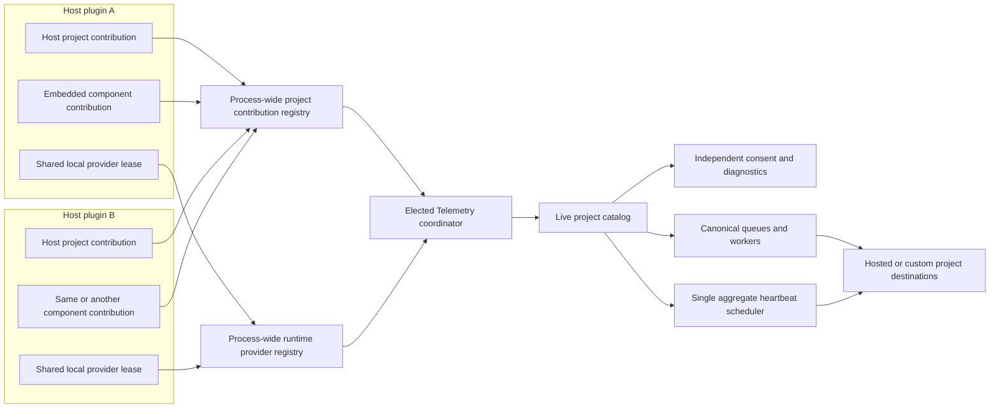

# Generic Embedded Telemetry Project Contributions

- **Status:** Approved design
- **Date:** 2026-08-06
- **Primary repository:** Alec's Telemetry
- **Reference integration:** Patchwork embedded by Alec's Tamework

## Decision

Alec's Telemetry will support first-class, dynamically registered project contributions from embeddable mods and libraries. An embedding component will be able to carry its own uniquely located telemetry descriptor, register an independently consented logical project, and obtain a project-scoped telemetry service while sharing the single elected Telemetry runtime in the server process.

Patchwork is the reference integration and the first acceptance fixture. The Telemetry API, registries, election rules, lifecycle, diagnostics, and data model must not contain Patchwork-specific identifiers or behavior. Any embeddable component must be able to use the same contract.

The selected design uses two independent process-wide protocols:

1. The existing runtime-provider protocol elects the one Telemetry runtime that owns handlers, commands, consent UI, queues, upload workers, and heartbeat scheduling.
2. A new project-contribution protocol elects one active contribution for each logical telemetry project and supplies the active runtime with a live project catalog.

Every contributed project owns its descriptor, project key, destination, consent, event schema, logical version, and project-scoped data. The physical host plugin is provenance for local diagnostics and deterministic election; it does not replace the logical project identity or inherit the host project's consent.

## Motivation

The current embedded bootstrap assumes one telemetry project per owning Hytale plugin. It loads one conventional descriptor from `Server/Telemetry/project.json` or `telemetry/project.json`, derives identity from the owning `JavaPlugin`, and builds a runtime snapshot around that registration. Installed-mod discovery likewise reads at most one conventional descriptor from each mod archive.

That model works for a host such as Tamework embedding Alec's Telemetry directly. It does not work for a component such as Patchwork that is itself embedded by Tamework or by another mod:

- Patchwork's descriptor would collide with the host's conventional descriptor when shaded into one jar.
- Bootstrapping Telemetry a second time with the host's `JavaPlugin` would still identify the provider and project as the host.
- A runtime built before the nested component registers currently has no live project-catalog update path.
- Two host mods may embed the same component, so classloader-safe project election and token-gated writes are required to prevent duplicate events and heartbeats.

The goal is therefore not “special-case Patchwork inside Tamework.” The goal is a reusable nested-project protocol with Patchwork proving the design under real shading, lifecycle, and classloader conditions.

## Goals

- Let any embeddable Java mod or library contribute a distinct Telemetry project from inside a physical host plugin.
- Preserve one active Telemetry runtime per server process.
- Give each logical project independent consent, settings, destination, queues, diagnostics, and project-scoped handles.
- Support the full existing Telemetry surface: crash capture, errors, lifecycle events, breadcrumbs, performance, usage, stats, and manual reports.
- Make contributor registration safe before or after a runtime provider becomes active.
- Elect one active candidate when several installed jars or host plugins contain the same logical component.
- Prevent calls from passive contribution candidates from producing duplicate telemetry.
- Preserve queued reports and immutable upload metadata when a contribution retires.
- Preserve source and binary compatibility for the existing `EmbeddedTelemetryBootstrap.bootstrap(JavaPlugin)` flow.
- Degrade locally: a descriptor, registry, provider, or endpoint failure must not prevent the embedding component from operating.
- Keep all cross-classloader protocol payloads JDK-only and versioned.
- Provide behavior-first verification for provider handoff, project handoff, consent independence, packaging, and isolated classloaders.

## Non-goals

- Discover arbitrary nested `Server/Telemetry/project.json` resources automatically.
- Make `TelemetryRuntimeLocator` the project-registration authority.
- Merge two descriptors for the same project.
- Allow a nested project to inherit the host project's consent implicitly.
- Treat a nested library as a separately installed Hytale plugin in the loaded-mod inventory.
- Add custom ModStats event storage. The hosted service continues to store only the standard stats heartbeat fields until that platform capability is designed separately.
- Add Patchwork-specific identifiers, event names, types, or election rules to Alec's Telemetry.
- Guarantee delivery when every Telemetry provider is unavailable or incompatible.
- Make Telemetry failure fatal to an embedding component.

## Terminology

**Logical project:** The independently consented Telemetry project, such as Patchwork. It owns the project ID, display name, descriptor, destination, logical component identifier, logical component version, and event schema.

**Physical host:** The loaded Hytale plugin whose jar and `JavaPlugin` contain the logical project at runtime, such as Tamework. It owns the plugin lifecycle and supplies a source path and data-root context.

**Contribution candidate:** One registered copy of a logical project. Several candidates may exist because a standalone component and multiple host plugins can contain the same component.

**Active contribution:** The elected candidate for one project ID. Only its token-bound contributor service may emit project telemetry.

**Runtime provider:** One standalone or embedded copy of Alec's Telemetry participating in the existing process-wide runtime election.

**Provider lease:** A local, reference-counted claim on the Telemetry provider candidate associated with one physical host and Telemetry classloader.

**Live project catalog:** The active runtime's immutable current snapshot of discovered, provider-owned, and contributed project winners.

## Architecture



The provider and project elections are deliberately separate. A newer Telemetry runtime may take over without changing which Patchwork contribution is active. A newer standalone Patchwork may take over its logical project without changing which Telemetry runtime owns uploads.

## Public Contributor API

### New contribution model

The runtime module will add a public immutable `TelemetryProjectContribution` with a builder. Its required inputs are:

- a resource-anchor class owned by the logical component;
- a unique descriptor resource path;
- the canonical logical plugin/component identifier;
- the logical component version.

The resource anchor is required so the descriptor is loaded from the contributor's defining classloader instead of whichever shaded resource happens to win a conventional path collision.

The contributor-facing shape will be:

```java
TelemetryProjectContribution contribution = TelemetryProjectContribution.builder()
        .descriptorResource(
                PatchworkTelemetry.class,
                "META-INF/alecs-telemetry/projects/patchwork.json"
        )
        .logicalPluginIdentifier("Alechilles:Patchwork")
        .logicalPluginVersion(PatchworkVersion.current())
        .build();

EmbeddedTelemetryService telemetry =
        EmbeddedTelemetryBootstrap.contribute(hostPlugin, contribution);
```

`EmbeddedTelemetryBootstrap.contribute(...)` returns the existing project-scoped `EmbeddedTelemetryService` surface so contributors can use the same record, capture, report, diagnostics, flush, start, and shutdown operations as direct host projects.

Environmental and packaged-content failures return a disabled service with a diagnostic reason and produce one bounded warning. Null arguments and structurally impossible builder calls remain programmer errors and may throw immediately.

### Derived fields

The bootstrap derives these fields from the physical host and descriptor rather than trusting caller input:

- project ID and display name from the parsed descriptor;
- physical host plugin identifier and version from `JavaPlugin`;
- physical source path from the host plugin file;
- shared coordinator data root from the physical host;
- origin as `STANDALONE` when the physical host identifier equals the logical component identifier, otherwise `EMBEDDED`;
- canonical descriptor hash from normalized descriptor content;
- package prefixes, destination, category support, defaults, reports, and UI metadata from the descriptor.

The canonical logical identifier supplied by the builder must appear in the descriptor's `ownerPluginIdentifiers`. The contribution is disabled when the two disagree.

### Existing bootstrap compatibility

`EmbeddedTelemetryBootstrap.bootstrap(JavaPlugin)` remains public and source/binary compatible. Internally it delegates to the same contribution machinery using:

- the existing conventional descriptor lookup;
- the host plugin as both physical host and logical project owner;
- the host manifest version as the logical project version.

Existing host integrations do not have to migrate in the first release. Migrating them later is an internal cleanup, not a compatibility requirement.

`TelemetryRuntimeLocator` remains the optional read/find API. It may return catalog-bound handles for integrations and administration, but it does not register contributions. Contributor services returned by `contribute(...)` are token-bound; locator handles are not contributor ownership tokens.

## Descriptor and Packaging Contract

A nested component must not ship its descriptor at either conventional path because those paths belong to the physical host archive:

```text
Server/Telemetry/project.json
telemetry/project.json
```

It instead ships a namespaced resource:

```text
META-INF/alecs-telemetry/projects/<stable-project-id>.json
```

The descriptor uses the normal Telemetry schema. No nested-only descriptor fields are added. Logical identity and host provenance belong to the contribution registration, not the descriptor document.

Each component selects its descriptor explicitly through its resource-anchor class. Telemetry does not enumerate this directory. This prevents accidental opt-in, shading-order dependence, and registration of dormant transitive libraries.

Patchwork's runtime artifact will declare `alecstelemetry-runtime` as a normal transitive runtime dependency. A host that embeds Patchwork therefore receives a contribution-capable Telemetry runtime automatically. A host such as Tamework that directly calls Telemetry APIs must retain its direct Telemetry dependency even though Patchwork also brings it transitively; direct dependency declaration remains correct ownership and allows dependency convergence to be explicit.

## Contribution Registry Protocol

### Process-wide and classloader-safe

The new contribution registry is process-wide and must work across isolated plugin classloaders. It follows the proven reflective/JDK-only shape used by the existing runtime-provider and Patchwork coordinator bridges.

Cross-classloader descriptors contain only:

- strings, numbers, booleans, lists, and maps;
- normalized paths represented as strings;
- raw or canonical descriptor JSON represented as a string;
- an opaque registration token represented as a string;
- a bridge object invoked reflectively through versioned JDK-only methods.

No Telemetry DTO, descriptor class, event-context class, or contributor class may cross the classloader boundary.

The initial contribution ABI is `1`. The runtime coordinator protocol advances from `2` to `3` because contribution snapshot replay, token validation, and live catalog reconciliation are required coordinator capabilities.

### Candidate fields

Every contribution candidate contains:

- contribution ABI;
- project ID;
- logical component identifier;
- logical component semantic version;
- derived origin (`STANDALONE` or `EMBEDDED`);
- physical host plugin identifier and version;
- normalized source path;
- canonical descriptor JSON and hash;
- registration bridge;
- opaque registration token.

The registry contains no credentials. Hosted project keys remain publishable descriptor data. Custom endpoint secrets remain in the existing settings mechanism and are not copied into contribution descriptors.

### Per-project election

Candidates are grouped case-insensitively by project ID. One winner is selected for each group using this order:

1. contribution ABI must be compatible;
2. highest logical component semantic version;
3. standalone before embedded when versions match;
4. physical host plugin identifier, case-insensitive lexical order;
5. normalized source path lexical order;
6. canonical descriptor hash lexical order as the final deterministic tie-breaker.

Invalid semantic versions disable that candidate rather than entering election.

Installed conventional descriptors and explicit provider registrations are represented in the live catalog as fixed candidates. When an installed standalone project and an explicit contribution describe the same logical owner and project, they join the same election. An exact same-source, same-version, same-hash registration is deduplicated.

### Owner and descriptor conflicts

The registry never merges descriptors.

- Same project ID and same logical component identifier: candidates participate in normal election.
- Same project ID and different logical component identifier: the current valid owner lineage is retained and the newcomer is quarantined. If no owner is active during initial reconciliation, the normal deterministic comparator establishes the first owner lineage and candidates from other identifiers are quarantined.
- Same logical project and version but different descriptor hash or hosted project key: one exact candidate wins through the normal tie-breakers; losing candidates remain passive and a descriptor-drift diagnostic is emitted.
- Overlapping package prefixes across different active projects: explicit project-scoped events continue, but automatic crash attribution for the ambiguous prefixes is suppressed for all affected projects. The collision appears in diagnostics and consent/status output.

A malformed, incompatible, rejected, or quarantined candidate never changes the last valid active catalog entry.

### Token-gated writes

The service returned to a contributor carries its opaque registration token. Every record, capture, report, and flush operation passes that token through the contribution bridge.

The active coordinator accepts the call only when:

- the token is registered;
- the token is the active candidate for that project ID;
- the project is present in the active catalog;
- the project/category consent and descriptor gates permit the operation.

Calls from passive or retired candidate tokens are safe no-ops with diagnostic state. This prevents duplicate output when two physical host plugins embed the same library even if both library copies execute telemetry calls.

## Local Provider Leases

Automatic transitive packaging requires a nested component to supply Telemetry when the host does not bootstrap it directly. It must not create duplicate local provider candidates when the host and several nested components all call Telemetry.

Each Telemetry classloader therefore owns a local provider pool keyed by:

- physical host plugin identifier;
- normalized physical source path;
- Telemetry runtime version;
- Telemetry classloader identity.

Each contributed project service acquires one prepared lease. The first started lease registers and starts the local runtime-provider candidate. Later started leases share it. Closing a service releases its lease; only the final started lease unregisters the local provider candidate.

The pool is local by design. Copies in different plugin classloaders still register separate provider candidates and rely on the process-wide provider election. Only the elected provider installs handlers, commands, UI integration, queues, workers, and heartbeat scheduling.

## Lifecycle

### Prepare

`contribute(...)` performs no host-fatal work. It:

1. reads and parses the anchored descriptor;
2. validates logical identity and semantic version;
3. creates a contribution candidate and opaque token;
4. acquires a prepared local provider lease;
5. returns a project-scoped service.

The service retains a small bounded pre-start buffer for explicit setup breadcrumbs, lifecycle events, and setup failures. This preserves the existing ability to capture failures that occur before `start()`.

### Start

The first successful `start()` call is idempotent and:

1. registers the contribution candidate if it is not already registered;
2. starts or joins the local provider lease;
3. allows the process-wide registries to elect provider and project winners;
4. causes the active provider to reconcile the complete contribution snapshot transactionally;
5. drains the pre-start buffer only if this contribution token is the project winner.

Pre-start buffers from passive candidates are discarded without upload. This prevents duplicate setup events from multiple copies of one logical component.

### Provider handoff

When the active Telemetry provider changes:

1. the old provider fences new local ownership work;
2. the contribution registry supplies an immutable full snapshot to the replacement;
3. the replacement validates and constructs a candidate catalog off to the side;
4. the replacement atomically publishes the new catalog only after validation succeeds;
5. stable project handles continue forwarding through the process-wide registries.

The replacement must not expose a partial catalog. If reconciliation fails, the provider activation fails and normal provider fallback continues.

### Contribution handoff

When the active candidate for one logical project changes:

1. the old token is fenced before the new token is accepted;
2. the active provider builds the replacement project entry from the new immutable descriptor snapshot;
3. the catalog swaps that project entry atomically;
4. the new token becomes writable;
5. the old token becomes a passive no-op.

There is no interval in which two contribution tokens may emit for the same project.

### Shutdown

`EmbeddedTelemetryService.shutdown()` remains idempotent. For contributed projects it:

1. fences new calls from the contribution token;
2. unregisters the contribution candidate;
3. removes the project from future heartbeat eligibility when no replacement candidate wins;
4. removes the project from the active consent list while retaining saved consent by project ID;
5. retains queued envelopes and their immutable descriptor/destination metadata for normal retry and recovery;
6. releases the provider lease;
7. unregisters the local provider candidate only when the final started lease closes.

Shutdown and registry failures are logged as bounded diagnostics and must not block the embedding component's shutdown. No unbounded retry thread is introduced.

## Live Project Catalog

The active Telemetry coordinator currently builds its project list from a startup discovery snapshot. The implementation will introduce a live catalog abstraction used by the core engine, consent runtime, commands, manual-report UI, stats scheduler, and runtime API.

Catalog reconciliation is serialized and transactional:

- build an immutable proposed snapshot;
- validate project IDs, destinations, descriptor schema, owner lineage, package-prefix collisions, and overrides;
- construct any new project runtime state;
- atomically publish the complete snapshot;
- retire removed entries after publication without deleting queued data.

Readers use immutable catalog snapshots. Event calls do not observe a partially updated project list. A failed add, replace, or removal retains the previous valid snapshot and rejects only the failing change.

Saved project overrides and consent remain keyed by project ID in the canonical shared Telemetry settings root. A project that disappears and later returns recovers its existing choices. A newly contributed project that was not included in the previous consent review is unreviewed and follows the existing first-review prompt behavior.

## Identity and Payload Semantics

The logical project identity drives all normal project telemetry fields:

- project ID and display name;
- project key or custom destination;
- logical component identifier;
- logical component version used by version charts;
- package prefixes used for crash attribution;
- category and field allowlists.

The physical host identity is retained for local status, collision diagnostics, provider/contribution election, and support logs:

- host plugin identifier and version;
- host source path;
- contribution token and state;
- local provider lease and provider candidate.

This design adds no new uploaded host-provenance field. Existing consented `loadedMods` heartbeat metadata continues to describe actually installed Hytale plugins. A nested component is not inserted into that installed-mod list solely because it contributed a project.

Stats heartbeats continue to use one scheduler and one aggregate request. The active snapshot includes each active project winner whose stats category is independently enabled. Hosted ingest fans the aggregate request out to the listed projects. Passive, retired, disabled, or unreviewed-as-disabled projects are excluded.

## Consent, Destinations, and Privacy

Each contributed project appears as its own project in consent and diagnostics. It owns:

- the project-level enabled choice;
- per-category support and defaults;
- crash, breadcrumb, event, performance, usage, stats, and reports choices;
- hosted project key or custom endpoint;
- manual report forms and attachment policy;
- project icon and display name;
- saved overrides and reviewed state.

The host project's choice never enables or disables a contributed project implicitly. Disabling Tamework telemetry does not disable Patchwork telemetry, and disabling Patchwork telemetry does not disable Tamework telemetry.

Contribution registration uploads nothing by itself. An event is emitted only after the active-token check, descriptor support check, independent consent check, allowlist/sampling/redaction checks, and existing destination rules all pass.

The canonical privacy policy must be updated in the same implementation change. It must explain:

- that an installed plugin may contain separately identified contributed projects;
- that each contributed project has independent consent and destination behavior;
- that logical project identifier/version are used for that project's attribution and public version charts;
- that physical host provenance remains local except for already documented loaded-mod metadata;
- that custom endpoint behavior remains controlled by the contributed project's settings and the third party receiving that data;
- that retiring a contribution does not immediately delete already queued reports and existing retention rules still apply.

## Full Telemetry Surface

The contribution protocol supports every existing project capability. “Full telemetry” means the protocol does not artificially limit nested projects; it does not mean registration emits data or bypasses descriptor defaults.

| Category | Contributed-project behavior |
| --- | --- |
| Crash | Automatic package-prefix attribution plus explicit setup/start failure capture and exceptional failures. |
| Errors | Project-declared error names and bounded detail allowlists. |
| Lifecycle | Project-declared component lifecycle and operation outcomes. |
| Breadcrumbs | Structured, redacted, bounded project breadcrumbs. |
| Performance | Thresholded and sampled project operation durations. |
| Usage | Explicit allowlisted feature and administrative command signals. |
| Stats | Standard aggregate heartbeat and ModStats fan-out. |
| Reports | Independent issue/suggestion forms, contact options, attachments, and resolution updates as declared. |

Custom stats event storage remains out of scope. Components that need operation counts use the existing errors, lifecycle, performance, or usage categories until hosted custom stats are designed.

## Patchwork Reference Integration

Patchwork proves the generic contract but does not define it.

### Packaging and lifecycle

- `patchwork-runtime` adds the contribution-capable `alecstelemetry-runtime` as a transitive dependency.
- Patchwork ships `META-INF/alecs-telemetry/projects/patchwork.json` from its runtime artifact.
- Patchwork creates one generic `TelemetryProjectContribution` using a Patchwork-owned resource-anchor class.
- The logical identifier is Patchwork's canonical plugin identifier and the logical version is the Patchwork runtime version, even when the physical host is Tamework.
- The Patchwork embedded service starts and closes its Telemetry contribution with Patchwork's existing runtime lifecycle.
- Patchwork telemetry failure logs one warning, produces a disabled service, and never prevents patch generation, publication, reload, or shutdown.
- The standalone Patchwork plugin uses the same contribution and descriptor. Derived origin becomes `STANDALONE` because the physical host identifier matches the logical component identifier.

### Reference signal set

Patchwork's descriptor declares crash, errors, lifecycle, breadcrumbs, performance, usage, stats, and reports with `supported: true` and explicit `defaultEnabled: true`. Report attachments remain subject to the existing manual-review, size, type, redaction, and consent rules; enabling reports does not auto-submit a report or attachment. Its integration layer may emit only the following initial signals:

- lifecycle: `runtime_activated`, `runtime_deactivated`, `generation_completed`, `reload_completed`;
- errors: `generation_failed`, `publish_failed`, `reload_failed`;
- performance: `generation_duration`, `reload_duration`;
- usage: bounded Patchwork administrative command and supported-feature signals with no player identity;
- breadcrumbs: high-level discovery, generation, publish, and reload phases;
- stats: the standard heartbeat only;
- crash: automatic `com.alechilles.patchwork` attribution and explicit Patchwork operation failures;
- reports: independent Patchwork issue and suggestion forms using existing report privacy and attachment limits.

Exact allowed detail fields and enum values are defined in Patchwork's descriptor and must remain low-cardinality. Telemetry core contains none of these event names.

### Tamework

Tamework retains its direct `alecstelemetry-runtime` dependency because it directly uses Telemetry APIs. Gradle dependency resolution must converge Tamework and Patchwork on one Telemetry runtime version within the shaded Tamework jar.

Tamework continues to bootstrap its own conventional project. Its embedded Patchwork copy contributes the Patchwork project separately. The packaged result must expose two independent projects and one local Telemetry provider candidate, while process-wide election still permits a newer standalone Telemetry provider to own runtime work.

## Failure Behavior

| Failure | Required outcome |
| --- | --- |
| Descriptor missing or malformed | Return a disabled contribution service; log one bounded warning; component continues. |
| Logical identifier absent from descriptor owners | Disable that contribution; component continues. |
| Invalid logical semantic version | Disable that candidate; do not enter election. |
| Contribution ABI incompatible | Keep candidate passive and expose diagnostics. |
| Conflicting owner for an active project ID | Quarantine newcomer; retain current winner. |
| Same-version descriptor drift | Elect one exact snapshot; warn; never merge. |
| Package-prefix overlap | Suppress ambiguous automatic crash attribution only; explicit project events remain available. |
| Catalog reconciliation failure | Keep the previous immutable catalog; reject only the change. |
| Active provider activation failure | Use normal provider fallback; disable reporting if none succeeds. |
| Active contribution retires | Fence it, elect replacement atomically, or remove from active catalog. |
| Hosted/custom endpoint unavailable | Use existing bounded queue, backoff, retry, and retention behavior. |
| Contribution shutdown failure | Log bounded diagnostics; do not block component shutdown. |

## Compatibility Matrix

| Installation | Expected provider state | Expected project state | Fallback |
| --- | --- | --- | --- |
| Existing direct embedded host only | Existing embedded provider participates normally. | Conventional host project remains available. | Existing behavior is preserved. |
| Host plus one contributed component | One local provider lease is active. | Host and component are independent projects. | Component reporting disables locally on contribution failure. |
| Host relies only on component's transitive Telemetry | Component starts the host-local provider lease. | Component project is active; host project exists only if the host contributes or ships a conventional descriptor. | Component operation continues if Telemetry cannot start. |
| Two hosts embed the same component | Provider election selects one Telemetry owner. | Per-project election selects one component token; passive-token calls no-op. | Next compatible component candidate wins on retirement. |
| Standalone and embedded component coexist | Provider election remains independent. | Highest compatible component version wins; standalone wins equal versions. | Embedded candidate takes over if standalone retires. |
| Older standalone Telemetry plus contribution-capable embedded runtime | Protocol-3 embedded runtime is the compatible contribution-aware candidate. | Contributed projects remain available. | Older protocol-2 provider remains passive/ineligible for the new coordinator protocol. |
| Newer contribution-capable standalone Telemetry plus embedded runtime | Newer standalone provider may win runtime election. | Full contribution snapshot replays into it. | Embedded provider resumes if standalone retires. |
| Malformed or conflicting contributed project | Existing valid provider remains active. | Only the bad project candidate is disabled/quarantined. | Host/component functionality is unaffected. |
| Custom endpoint contributed project | Shared coordinator still owns runtime work. | Project uses its independent custom destination and consent. | Hosted projects remain separate and unaffected. |

## Verification Strategy

Tests are added only for observable production behavior. No source-text, declaration-order, asset-presence, exact-file-count, or implementation-shape tests are part of this design.

### Alec's Telemetry behavior tests

1. Register a conventional host project and one contributed project; start the services; assert two independent runtime project handles and one active provider.
2. Disable host consent while leaving component consent enabled; assert the host event is rejected and the component event is persisted or delivered.
3. Register two versions of the same logical component; assert only the winning token can persist an event.
4. Close the winning contribution; assert the fallback token becomes writable without a duplicate interval.
5. Register the same project ID from a different logical owner; assert the current project remains active and the newcomer is quarantined.
6. Replace an active provider with a newer isolated-classloader provider; assert the full project catalog replays and stable handles continue routing.
7. Force proposed-catalog construction to fail; assert the previous catalog still accepts valid project events.
8. Remove a contribution after queueing an envelope; assert new calls no-op and the retained envelope can still flush using immutable upload metadata.
9. Register overlapping crash package prefixes; assert an automatic crash is not duplicated while explicit project error recording remains available.
10. Exercise pre-start capture on two duplicate contribution candidates; assert only the eventual winner's buffered event is persisted.
11. Exercise the existing `bootstrap(JavaPlugin)` path against the new machinery; assert its observable project identity and event behavior remain unchanged.

### Packaged and isolated integration tests

1. Load real packaged Telemetry runtime jars through isolated classloaders and verify contribution registration, provider handoff, project handoff, and token-gated routing.
2. Build the Patchwork standalone jar and a minimal shaded host fixture; execute their production bootstraps and assert one Patchwork project winner.
3. Build Tamework's shaded jar with its direct Telemetry dependency and transitive Patchwork dependency; execute packaged integration behavior and assert Tamework plus Patchwork projects with one local provider.
4. Combine Tamework, standalone Patchwork, and standalone Telemetry candidates; verify independent provider and project election outcomes.

These tests invoke production bootstraps and assert runtime results. They do not inspect jar text merely to prove that a class or descriptor exists.

### Builds

After implementation custody returns to the main integration thread, run the repositories' normal verification:

- Alec's Telemetry: `bash ../gradlew :alecstelemetry:standalone:build`
- Patchwork: its root Maven test/package workflow, including isolated integration tests
- Tamework: `bash ../gradlew :alecstamework:test` and its packaged integration task

Live verification is required only for Hytale lifecycle behavior that the packaged integration tests cannot exercise. If used, launch one controlled test server, record its exact process tree, and terminate that tree immediately after evidence collection.

## Documentation and Privacy Updates

The implementation change updates:

- `docs/embedded-mode.md` with direct-host versus contributed-project guidance;
- `docs/project-descriptor.md` with the namespaced nested-resource rule;
- a new contributor guide showing the generic API and packaging contract;
- `docs/usage-stats.md` with active contributed-project heartbeat eligibility;
- command/status documentation with logical owner, host provenance, candidate state, and conflict diagnostics;
- `docs/privacy-policy.md` with nested-project consent, identity, destination, queue, and retention behavior;
- Patchwork's README/wiki with standalone and embedded Telemetry behavior;
- Tamework's integration documentation where its packaged dependency relationship is described.

Release notes must call out the coordinator protocol advance, existing-bootstrap compatibility, and the automatic Telemetry dependency added to Patchwork.

## Rollout

The feature is delivered in this order:

1. Alec's Telemetry adds contribution ABI 1, coordinator protocol 3, local provider leases, token-bound services, transactional live catalog reconciliation, diagnostics, documentation, and privacy coverage.
2. Alec's Telemetry publishes the contribution-capable runtime before consumers adopt it.
3. Patchwork adopts the generic API, publishes its namespaced descriptor, adds the transitive runtime dependency, and verifies standalone plus embedded behavior.
4. Tamework aligns its direct Telemetry version with Patchwork's transitive version and verifies the two-project packaged result.
5. Other embeddable mods may adopt the same public contract without Telemetry-core changes.

The recommended release line is Alec's Telemetry `1.1.0` followed by Patchwork `1.3.0`. The first Tamework release adopting Patchwork `1.3.x` must resolve Alec's Telemetry `1.1.x` directly and transitively to the same artifact.

## Acceptance Criteria

The design is implemented when all of the following are true:

- A generic embeddable component can contribute a uniquely resourced project without using a conventional descriptor path.
- The component automatically supplies a compatible Telemetry provider when its host does not.
- A direct host project and a nested component project coexist with independent consent and destinations.
- Two physical hosts embedding the same logical component produce one active project and no duplicate token-bound events.
- Standalone and embedded component copies follow deterministic semantic-version/origin election and fail over cleanly.
- Telemetry provider handoff replays the complete contribution snapshot without partial catalog exposure or duplicate workers.
- Retiring a contribution stops new events but does not strand already queued envelopes.
- Full existing Telemetry categories are available to contributed projects under the normal descriptor, consent, redaction, and retention gates.
- Physical host provenance remains local except for already documented installed-mod metadata.
- Existing `bootstrap(JavaPlugin)` integrations continue to behave compatibly.
- Telemetry failures never prevent the embedding component's normal operation.
- Alec's Telemetry privacy and integration documentation accurately describe the shipped behavior.
- The behavior-first unit, isolated-classloader, packaging, and multi-mod verification cases pass.
